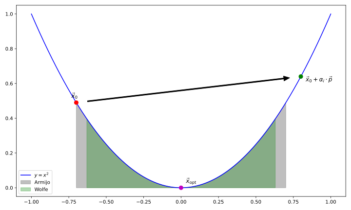
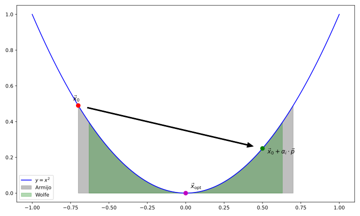
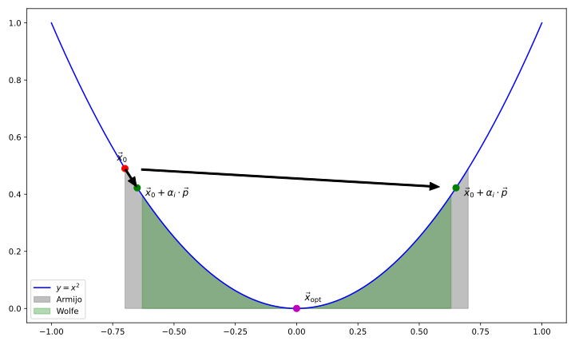

+++
title = "The BFGS Algorithm Family in Rust (Part 1)"
description = "The BFGS implementation"
[taxonomies]
tags = ["rust", "algorithms", "programming"]
+++

The BFGS (Broyden-Fletcher-Goldfarb-Shanno) algorithm and its derivatives were (and for the most part still are) the gold standard methods for quasi-Newton optimization. In this post, I want to give a brief overview of the main idea, the limited-memory adaptation (L-BFGS), and the bounded version (L-BFGS-B) and how I implemented them in a Rust crate I'm developing called [`ganesh`](https://github.com/denehoffman/ganesh). The full algorithm can be seen there, and I will mainly be focusing on the main methodology, since the actual literature on it is rather old and difficult to parse (and even has a few typos!).

That being said, I wouldn't have done it without the following articles/projects which have guided my understanding:

- ["Numerical Optimization"](https://doi.org/10.1007/978-0-387-40065-5) by Jorge Nocedal and Stephen J. Wright
- ["Numerical Optimization: Understanding L-BFGS"](https://aria42.com/blog/2014/12/understanding-lbfgs) by [Aria Haghighi](https://aria42.com/)
- [L-BFGS-B in pure Python](https://github.com/avieira/python_lbfgsb/) by [@avieira (Alex Vieira?)](https://github.com/avieira)
- [L-BFGS-B in pure MATLAB](https://github.com/bgranzow/L-BFGS-B) by [Brian Granzow](https://github.com/bgranzow)
- ["A Limited Memory Algorithm for Bound Constrained Optimization"](https://doi.org/10.1137/0916069) by Richard H. Byrd, Peihuang Lu, Jorge Nocedal, and Ciyou Zhu

# Quasi-Newton?

Typically, in numeric optimization problems, we want to define some stepping process that will cause us to approach a minimum or maximum as quickly as possible. For our purposes, we'll just assume we only care about minimizing, and we'll also assume that there *is* a single global minimum to the function in question, or at least that we don't care about falling into a deep local minimum. The simplest non-trivial way to do this is by gradient descent:
$$
\vec{x}_{k+1} = \vec{x}_k - \alpha_k \vec{\nabla} f(\vec{x}_k)
$$
where $f: \mathbb{R}^n \to \mathbb{R}$ is the objective function we are trying to minimize and $\alpha_n$ is some positive step length (also called the learning rate). The minus sign here is why we call it gradient descent; we are always moving opposite the gradient, which always points uphill. For simplicity, we'll also refer to the gradient as a function $\vec{g}(\vec{x}) \equiv \vec{\nabla}f(\vec{x})$ Now if you just throw in some very small value for $\alpha$ and cross your fingers, you might eventually end up at the function's minimum, but it certainly won't be the most efficient way to get there. If your $\alpha$ is too big, you could end up overshooting the minimum and bouncing back and forth around it endlessly.

There are several ways we can optimize the choice of step length. Skip ahead to [here](#line-searches) to see the implementation I use for the BFGS family.

# Rust implementation

## Function trait

Let's start by defining a trait which will evaluate our function $f$ and its gradient $\vec{g}$. I want the input parameter values $\vec{x}$ to be generic so that both `f64` and `f32` types can be used, as well as any other struct with the right trait implementations. I also want these functions to return `Result`s with a generic error type `E` so that users can handle any errors their own functions create. Finally, we should consider adding optional arguments to these functions. Again, we will turn to generics, but allow users to pass a `&mut U` called `user_data`. This term is mutable because it will give us the most flexibility later on. The trait for a function might look something like this:

```rust
use num::{traits::NumAssign, Float, FromPrimitive};

pub trait Function<T, U, E>
where
    T: Float + FromPrimitive + Debug + NumAssign,
{
    fn evaluate(&self, x: &[T], user_data: &mut U) -> Result<T, E>;
 
    fn gradient(&self, x: &[T], user_data: &mut U) -> Result<Vec<T>, E> {
        let n = x.len();
        let mut grad = vec![T::zero(); n];
        let h: Vec<T> = x
            .iter()
            .map(|&xi| T::cbrt(T::epsilon()) * (if xi == T::zero() { T::one() } else { xi }))
            .collect();
        for i in 0..n {
            let mut x_plus = x.to_vec();
            let mut x_minus = x.to_vec();
            x_plus[i] += h[i];
            x_minus[i] -= h[i];
            let f_plus = self.evaluate(&x_plus, user_data)?;
            let f_minus = self.evaluate(&x_minus, user_data)?;
            grad[i] = (f_plus - f_minus) / (convert!(2.0, T) * h[i]);
        }
        Ok(grad)
    }
}
```

I also use a little macro to convert raw numeric fields to our generic type `T`, if possible:

```rust
#[macro_export]
macro_rules! convert {
    ($value:expr, $type:ty) => {{
        #[allow(clippy::unwrap_used)]
        <$type as num::NumCast>::from($value).unwrap()
    }};
}
```

Let's walk through the anatomy of the trait above. I think the `evaluate` method is pretty self-explanatory (given that it's an empty template), but the gradient method is a bit more complex. First of all, I'm implementing a central finite-difference here:
$$
\frac{\partial f(\vec{x})}{\partial x_i} = \frac{f(\vec{x} + h_i \hat{e}_i) - f(\vec{x} - h_i \hat{e}_i)}{2h_i}
$$
The tricky detail is choosing a value for $h_i$. In practice, machine epsilon is too small! What we actually should use is $h_i = \sqrt[3]{\varepsilon} x_i $ when $x_i \neq 0$ and $h_i = \sqrt[3]{\varepsilon}$ in the event that $x_i = 0$.

## Algorithm Trait

Next, since we want to implement three algorithms with very similar features, it might make sense to create a generic trait that can be used by some executor that will wrap all of these methods into a nice API. All of these algorithms will will need to know the following:

1. The objective `Function`
2. The starting point $x_0$
3. Any bounds on the free parameters (we will ignore bounds for the BFGS and L-BFGS methods here, although an experimental change of variables is implemented in the final crate)
4. The `user_data` to pass to the `Function`

We should also define what an algorithm should give us in return!

1. The best position at the end of the minimization, $x_\text{best}$
2. The function value at that point, $f(x_\text{best})$
3. The number of function/gradient evaluations
4. Some indication as to whether the result of the minimization is valid
5. Some `String` message that can tell us any additional information about how the fit progressed/is progressing

Let's call this struct `Status` and define it as follows:

```rust
#[derive(Debug, Default, Clone)]
pub struct Status<T> {
    pub message: String,
    pub x: Vec<T>,
    pub fx: T,
    pub n_f_evals: usize,
    pub n_g_evals: usize,
    pub converged: bool,
}
impl<T> Status<T> {
    pub fn update_message(&mut self, message: &str) {
        self.message = message.to_string();
    }
    pub fn update_position(&mut self, pos: (Vec<T>, T)) {
        self.x = pos.0;
        self.fx = pos.1;
    }
    pub fn set_converged(&mut self) {
        self.converged = true;
    }
    pub fn inc_n_f_evals(&mut self) {
        self.n_f_evals += 1;
    }
    pub fn inc_n_g_evals(&mut self) {
        self.n_g_evals += 1;
    }
}
impl<T> Display for Status<T>
where
    T: Debug + Display,
{
    fn fmt(&self, f: &mut std::fmt::Formatter<'_>) -> std::fmt::Result {
        writeln!(f, "MSG:       {}", self.message)?;
        writeln!(f, "X:         {:?}", self.x)?;
        writeln!(f, "F(X):      {}", self.fx)?;
        writeln!(f, "N_F_EVALS: {}", self.n_f_evals)?;
        writeln!(f, "N_G_EVALS: {}", self.n_g_evals)?;
        write!(f, "CONVERGED: {}", self.converged)
    }
}
```

Note that we have set this up in a way that doesn't let any algorithm decrement the number of function/gradient evaluations. Additionally, no outside function can un-converge a converged `Status`. We will also typically update $f(x_\text{best})$ every time we update $x_\text{best}$, so there's only one way to do this to ensure they don't get out of sync for any reason.

Next, the `Algorithm` trait itself:

```rust
pub trait Algorithm<T, U, E> {
    fn initialize(
        &mut self,
        func: &dyn Function<T, U, E>,
        x0: &[T],
        bounds: Option<&Vec<Bound<T>>>,
        user_data: &mut U,
    ) -> Result<(), E>;
    fn step(
        &mut self,
        i_step: usize,
        func: &dyn Function<T, U, E>,
        bounds: Option<&Vec<Bound<T>>>,
        user_data: &mut U,
    ) -> Result<(), E>;
    fn check_for_termination(
        &mut self,
        func: &dyn Function<T, U, E>,
        bounds: Option<&Vec<Bound<T>>>,
        user_data: &mut U,
    ) -> Result<bool, E>;
    fn get_status(&self) -> &Status<T>;
    fn postprocessing(
        &mut self,
        func: &dyn Function<T, U, E>,
        bounds: Option<&Vec<Bound<T>>>,
        user_data: &mut U,
    ) -> Result<(), E> {
        Ok(())
    }
}
```

Most of these methods are fairly self-explanatory and have very similar signatures. Finally, let's wrap all of this up in a nice interface for the end-user to work with:

```rust
pub struct Minimizer<T, U, E, A>
where
    A: Algorithm<T, U, E>,
{
    pub status: Status<T>,
    algorithm: A,
    bounds: Option<Vec<Bound<T>>>,
    max_steps: usize,
    dimension: usize,
    _user_data: PhantomData<U>,
    _error: PhantomData<E>,
}

impl<T, U, E, A: Algorithm<T, U, E>> Minimizer<T, U, E, A>
where
    T: Float + FromPrimitive + Debug + Display + Default,
{
    const DEFAULT_MAX_STEPS: usize = 4000;
    pub fn new(algorithm: A, dimension: usize) -> Self {
        Self {
            status: Status::default(),
            algorithm,
            bounds: None,
            max_steps: Self::DEFAULT_MAX_STEPS,
            dimension,
            _user_data: PhantomData,
            _error: PhantomData,
        }
    }
    pub fn with_algorithm(mut self, algorithm: A) -> Self {
        self.algorithm = algorithm;
        self
    }
    pub const fn with_max_steps(mut self, max_steps: usize) -> Self {
        self.max_steps = max_steps;
        self
    }
    pub fn minimize(
        &mut self,
        func: &dyn Function<T, U, E>,
        x0: &[T],
        user_data: &mut U,
    ) -> Result<(), E> {
        self.algorithm
            .initialize(func, x0, self.bounds.as_ref(), user_data)?;
        let mut current_step = 0;
        while current_step <= self.max_steps
            && !self
                .algorithm
                .check_for_termination(func, self.bounds.as_ref(), user_data)?
        {
            self.algorithm
                .step(current_step, func, self.bounds.as_ref(), user_data)?;
            current_step += 1;
        }
        self.algorithm
            .postprocessing(func, self.bounds.as_ref(), user_data)?;
        let mut status = self.algorithm.get_status().clone();
        if current_step > self.max_steps && !status.converged {
            status.update_message("MAX EVALS");
        }
        self.status = status;
        Ok(())
    }
}
```

For now, we will ignore the `Bound` struct mentioned here, since we won't use it till we get to the `L-BFGS-B` algorithm. Note that `PhantomData` is required here because we don't actually store anything of type `U` or `E` but we need to include it in generics.

The main `minimize` function should also look pretty straightforward. We first call `Algorithm::initialize` and then proceed into a while-loop that checks if we either exceed the maximum allowed algorithm steps or if `Algorithm::check_for_termination` tells us to stop the algorithm (in case of problems or convergence). Inside this loop, we just run `Algorithm::step`. We finish off with `Algorithm::postprocessing` and grab the final `Status` of the algorithm. This will be the workflow for every `Algorithm` we implement[^1].

# Line Searches

We will be implementing an algorithm that attempts to satisfy the Strong Wolfe conditions. These are conditions for accepting a step length given some step direction $\vec{p}$ (we'll see later why we need to generalize this, but for now you can always just imagine $\vec{p} = -g(\vec{x})$).

The first of these conditions is also called the Armijo rule:
$$
f(\vec{x} + \alpha_k \vec{p}) \leq f(\vec{x}) + c_1 \alpha_k \left(\vec{p} \cdot \vec{g}(\vec{x})\right)
$$
for some value $0 < c_1 < 1$. The usual choice of $c_1$ is $10^{-4}$, which I believe just comes from some experimentation on standard test functions. This method is also called the sufficient decrease condition, and we can see why. The left-hand side is the function value at the new location, which we hope is at least smaller than the previous location (otherwise we are ascending!). However, for it to be sufficiently smaller, the difference must exceed the final term in the equation, which is usually going to be negative due to that dot product.

The second condition, dubbed the curvature condition, requires that the gradient of the function decrease sufficiently. This is usually harder to accomplish, so when we implement this in Rust, we will make it optional but desired.
$$
-\left(\vec{p} \cdot \vec{g}(\vec{x} + \alpha_k \vec{p})\right) \leq -c_2 \left(\vec{p} \cdot \vec{g}(\vec{x})\right)
$$
This condition adds another hyperparameter, $0 < c_1 < c_2 < 1$ where $c_2 = 0.9$ in most applications. However, if we really want to find the best point, we should try to satisfy the **strong** version of the curvature condition:
$$
\left|\vec{p}_k \cdot \vec{g}(\vec{x}_k + \alpha_k \vec{p}_k)\right| \leq c_2 \left|\vec{p}_k \cdot \vec{g}(\vec{x}_k)\right|
$$

We'll start the implementation with another trait (since other algorithms might use a different search method):

```rust
pub trait LineSearch<T, U, E> {
    fn search(
        &mut self,
        x: &DVector<T>,
        p: &DVector<T>,
        max_step: Option<T>,
        func: &dyn Function<T, U, E>,
        bounds: Option<&Vec<Bound<T>>>,
        user_data: &mut U,
        status: &mut Status<T>,
    ) -> Result<(bool, T, T, Vec<T>), E>;
}
```

We'll be implementing Algorithms 3.5 and 3.6 from ["Numerical Optimization"](https://doi.org/10.1007/978-0-387-40065-5), which (roughly) reads as follows:

#### Algorithm 3.5

1. $\alpha_0 \gets 0$, $\alpha_\text{max} > 0$, $\alpha_1 \in (0, \alpha_\text{max})$, $i \gets 1$
2. `loop`
   1. `if`

      $f(\vec{x} + \alpha_i \vec{p}) > f(\vec{x}) + c_1\alpha_i\left(\vec{p}\cdot\vec{g}(\vec{x})\right)$ (not Armijo)

      `or`

      ($i > 1$ `and` $f(\vec{x} + \alpha_i \vec{p}) \geq f(\vec{x} + \alpha_{i-1}\vec{p})$) (the function value has not decreased since the previous step)

      `then` `return` $\text{zoom}(\alpha_{i-1}, \alpha_i)$
   2. `if`

      $\left|\vec{p}\cdot\vec{g}(\vec{x} + \alpha_i\vec{p})\right| < c_2 \left|\vec{p}\cdot\vec{g}(\vec{x})\right|$ (strong Wolfe)

      `then` `return` $\alpha_i$
   3. `if`

      $\vec{p}\cdot\vec{g}(\vec{x} + \alpha_i\vec{p}) \geq 0$ (gradient at new position generally points in the same direction as the given step direction)

      `then` `return` $\text{zoom}(\alpha_i,\alpha_{i-1})$
   4. $\alpha_{i+1} \in (\alpha_i, \alpha_\text{max})$ (choose some larger step that is smaller than the max step)
   5. $i \gets i + 1$

In each loop, we are first checking to see if the function is sufficiently decreasing. If it isn't, we know that the step size overshoots. Imagine we are just minimizing into a 1D parabola. If we are sitting to the left of the minimum, the optimal step length $\alpha_\text{opt}$ would put us right at the minimum. If we pick a step $\alpha < \alpha_\text{opt}$ would be fine, but it would mean we converge slower than optimal. The same can be said for a step length $\alpha > \alpha_\text{opt}$, but at a certain point, we will be stepping to a point higher up the parabola than where we began, even though we are moving in the right direction! Step 2.1 ensures that if this happens, we will do a more refined search (`zoom`) between the current and previous step lengths (note that $\alpha_{i-1} = 0$ when $i=1$ on the first loop). This will happen a lot if we pick a starting step length that is too large (see the following diagram).


If we are decreasing, we are in that region where we are converging, but we might not be converging at an optimal rate. This is where the strong Wolfe condition comes in. We first project the gradients at the original and stepped positions onto the step direction. If the gradient *is* the step direction (well, opposite to it), then we can ignore $\vec{p}$ here and think of this in terms of a change in gradient magnitude. If the gradient decreases by at least a factor of $c_2$, we accept the step (see the following diagram).



If we are decreasing sufficiently, but the magnitude of the projected gradient isn't (the gray region in the previous plots), we are either undershooting the optimal step, in which case we should increase the step size and run the loop again (Step 4) or we are overshooting, in which case we should run `zoom` between the current step and the previous one. How do we tell? Well, if we overshoot, the gradient on the next step will tell us to move in the opposite direction, but if we undershoot, we should still be moving in the same direction. This is what the if-statement of Step 3. checks for.



In the above plot, both points meet the Armijo condition, but they fail to meet the strong Wolfe condition. This means they make it to Step 3 in our line search algorithm. For the left-most point, the gradient points in the $-x$ direction while the step was in the $+x$ direction, so the condition at Step 3 is not satisfied, and we increase our step size (hopefully landing in the green region). For the right-most point, the gradient now points in the $+x$ direction, so Step 3 is satisfied and we again `zoom` between this step size and the previous. Note that the arguments to `zoom` are switched here. In the definition of the `zoom` algorithm, we will refer to the first argument as $\alpha_{\text{lo}}$ and the second as $\alpha_{\text{hi}}$. However, since $\alpha_i$ is strictly increasing in Algorithm 3.5, we shouldn't think of one of these values as larger than the other, but rather that the function evaluations at these points are lower or higher. Here, $\alpha_\text{lo}$ will always refer to a step length which satisfied the Armijo condition, which means that the function value with this step length is the lower of the two. $\alpha_\text{hi}$ will be the previous step if the current one is the first to satisfy the Armijo condition (Step 2.3) or it will be the current step if the previous step gave a smaller function evaluation (Step 2.1). In either case, we know that the optimal step length is in the given range.

#### Algorithm 3.6 (`zoom`)

1. loop
   1. Choose $\alpha_j$ between $\alpha_{\text{lo}}$ and $\alpha_{\text{hi}}$ (it's possible for $\alpha_\text{lo} > \alpha_\text{hi}$).
   2. `if`

      $f(\vec{x} + \alpha_j \vec{p}) > f(\vec{x}) + c_1\alpha_j\left(\vec{p}\cdot\vec{g}(\vec{x})\right)$ (not Armijo)

      `or`

      $f(\vec{x} + \alpha_j \vec{p}) \geq f(\vec{x} + \alpha_{\text{lo}}\vec{p})$ (the function value has not decreased relative to $\alpha_{\text{lo}}$)

      `then` $\alpha_\text{hi} \gets \alpha_j$

      `else`
         1. `if`

            $\left|\vec{p}\cdot\vec{g}(\vec{x} + \alpha_j\vec{p})\right| \leq c_2\left|\vec{p}\cdot\vec{g}(\vec{x})\right|$

             `then` `return` $\alpha_j$
         2. `if`

            $\vec{p}\cdot\vec{g}(\vec{x} + \alpha_j\vec{p}) (\alpha_\text{hi} - \alpha_\text{lo}) \geq 0$

            `then` $\alpha_\text{hi} \gets \alpha_\text{lo}$
         3. $\alpha_\text{lo} \gets \alpha_j$

There are only a few possible outcomes of this loop. The "middle" outcome is to return $\alpha_j$ if it satisfies the Strong Wolfe and Armijo conditions. We check first for Armijo (remember, this is generally less restrictive), and if it's not satisfied, or if the evaluation is worse than $\alpha_{\text{lo}}$, we move $\alpha_{\text{hi}}$ to $\alpha_j$. Remember, the subscripts represent the relative value of the function evaluated at that step, and we know that [Algorithm 3.5](#algorithm-3-5) will guarantee that the two steps given will surround the "green" region of optimal step size. If Armijo is satisfied but Wolfe is not, we will always move $\alpha_{\text{lo}}$ up to $\alpha_j$, but if the condition in 2.2 is met, this implies that either the order of $\alpha_{\text{hi}}$ and $\alpha_{\text{lo}}$ is opposite what we think it should be (because in reality these functions are not always smooth minima like the previous diagrams) or the step $\alpha_j$ no longer goes in the direction of steepest descent. In either case, we then need move our $\alpha_{\text{hi}}$ endpoint to $\alpha_{\text{lo}}$ first. I'd recommend drawing out several minima scenarios to get a handle on this algorithm, but eventually it will start to make some sense.

Together, these algorithms constitute a line search which should result in a step that satisfies Strong Wolfe curvature conditions. This is needed to get optimal convergence from BFGS-like algorithms, but in practice it's not always efficient to run either algorithm in a (possibly infinite) loop, so I add a maximum number of loops to both algorithms. From my own testing, most problems will have no issue converging within a maximum of `100` iterations for each algorithm. That being said, here's my implementation of the line search:

```rust
pub struct StrongWolfeLineSearch<T> {
    max_iters: usize,
    max_zoom: usize,
    c1: T,
    c2: T,
}

impl<T> Default for StrongWolfeLineSearch<T>
where
    T: Float,
{
    fn default() -> Self {
        Self {
            max_iters: 100,
            max_zoom: 100,
            c1: convert!(1e-4, T),
            c2: convert!(0.9, T),
        }
    }
}

impl<T> StrongWolfeLineSearch<T>
where
    T: Float + RealField,
{
    fn f_eval<U, E>(
        &self,
        func: &dyn Function<T, U, E>,
        x: &DVector<T>,
        bounds: Option<&Vec<Bound<T>>>,
        user_data: &mut U,
        status: &mut Status<T>,
    ) -> Result<T, E> {
        status.inc_n_f_evals();
        func.evaluate(x.as_slice(), user_data)
    }
    fn g_eval<U, E>(
        &self,
        func: &dyn Function<T, U, E>,
        x: &DVector<T>,
        bounds: Option<&Vec<Bound<T>>>,
        user_data: &mut U,
        status: &mut Status<T>,
    ) -> Result<DVector<T>, E> {
        status.inc_n_g_evals();
        func.gradient(x.as_slice(), user_data).map(DVector::from)
    }

    // Algorithm 3.6
    fn zoom<U, E>(
        &self,
        func: &dyn Function<T, U, E>,
        x0: &DVector<T>,
        bounds: Option<&Vec<Bound<T>>>,
        user_data: &mut U,
        f0: T,
        g0: &DVector<T>,
        p: &DVector<T>,
        alpha_lo: T,
        alpha_hi: T,
        status: &mut Status<T>,
    ) -> Result<(bool, T, T, DVector<T>), E> {
        let mut alpha_lo = alpha_lo;
        let mut alpha_hi = alpha_hi;
        let dphi0 = g0.dot(p);
        let mut i = 0;
        loop {
            let alpha_i = (alpha_lo + alpha_hi) / convert!(2, T);
            let x = x0 + p.scale(alpha_i);
            let f_i = self.f_eval(func, &x, bounds, user_data, status)?;
            let x_lo = x0 + p.scale(alpha_lo);
            let f_lo = self.f_eval(func, &x_lo, bounds, user_data, status)?;
            let valid = if (f_i > f0 + self.c1 * alpha_i * dphi0) || (f_i >= f_lo) {
                alpha_hi = alpha_i;
                false
            } else {
                let g_i = self.g_eval(func, &x, bounds, user_data, status)?;
                let dphi = g_i.dot(p);
                if Float::abs(dphi) <= -self.c2 * dphi0 {
                    return Ok((true, alpha_i, f_i, g_i));
                }
                if dphi * (alpha_hi - alpha_lo) >= T::zero() {
                    alpha_hi = alpha_lo;
                }
                alpha_lo = alpha_i;
                true
            };
            i += 1;
            if i > self.max_zoom {
                let g_i = self.g_eval(func, &x, bounds, user_data, status)?;
                return Ok((valid, alpha_i, f_i, g_i));
            }
        }
    }
}

impl<T, U, E> LineSearch<T, U, E> for StrongWolfeLineSearch<T>
where
    T: Float + FromPrimitive + Debug + RealField + 'static,
{
    // Algorithm 3.5
    fn search(
        &mut self,
        x0: &DVector<T>,
        p: &DVector<T>,
        max_step: Option<T>,
        func: &dyn Function<T, U, E>,
        bounds: Option<&Vec<Bound<T>>>,
        user_data: &mut U,
        status: &mut Status<T>,
    ) -> Result<(bool, T, T, DVector<T>), E> {
        let f0 = self.f_eval(func, x0, bounds, user_data, status)?;
        let g0 = self.g_eval(func, x0, bounds, user_data, status)?;
        let alpha_max = max_step.map_or_else(T::one, |alpha_max| alpha_max);
        let mut alpha_im1 = T::zero();
        let mut alpha_i = T::one();
        let mut f_im1 = f0;
        let dphi0 = g0.dot(p);
        let mut i = 0;
        loop {
            let x = x0 + p.scale(alpha_i);
            let f_i = self.f_eval(func, &x, bounds, user_data, status)?;
            if (f_i > f0 + self.c1 * dphi0) || (i > 1 && f_i >= f_im1) {
                return self.zoom(
                    func, x0, bounds, user_data, f0, &g0, p, alpha_im1, alpha_i, status,
                );
            }
            let g_i = self.g_eval(func, &x, bounds, user_data, status)?;
            let dphi = g_i.dot(p);
            if Float::abs(dphi) <= self.c2 * Float::abs(dphi0) {
                return Ok((true, alpha_i, f_i, g_i));
            }
            if dphi >= T::zero() {
                return self.zoom(
                    func, x0, bounds, user_data, f0, &g0, p, alpha_i, alpha_im1, status,
                );
            }
            alpha_im1 = alpha_i;
            f_im1 = f_i;
            alpha_i += convert!(0.8, T) * (alpha_max - alpha_i);
            i += 1;
            if i > self.max_iters {
                return Ok((false, alpha_i, f_i, g_i));
            }
        }
    }
}
```

The full implementation (with a nicer API and some other features I'm not going to mention in these blog posts) can be found [here](https://github.com/denehoffman/ganesh/blob/604a8ebd47c519fe07104439e87e22b2425e9f62/src/algorithms/line_search.rs). In the [next post](@/blog/2024-12-15-the-bfgs-algorithm-family-in-rust-part-2/index.md), I will describe the first of the BFGS family of algorithms, the standard BFGS algorithm (no bounds, no limited-memory optimizations).

[^1]: In the full code, there are additional clauses for updating outside `Observer`s, which can monitor the `Algorithm` at each step.
