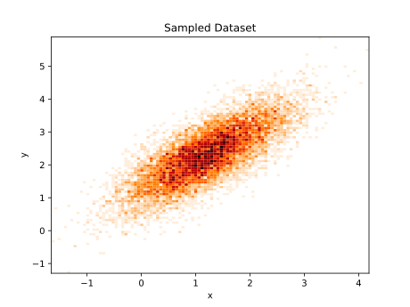
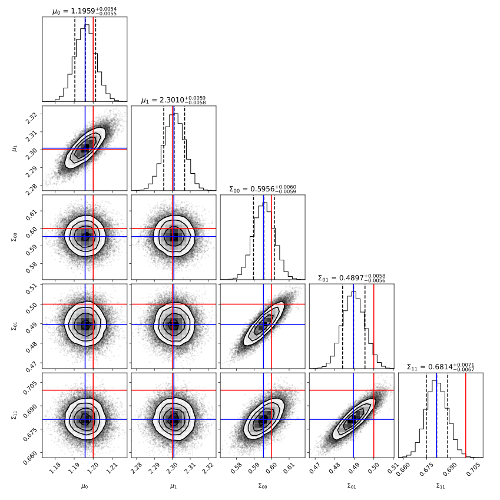

+++
title = "ganesh: A New Optimization Crate for Rust"
description = "A different approach to optimization in Rust"
[taxonomies]
tags = ["rust", "programming", "algorithms", "ganesh", "optimization", "minimization"]
+++

For the last year or so, I've been working on a new optimization crate for Rust, called [`ganesh`](https://github.com/denehoffman/ganesh). In this blog post, I'd like to introduce the project, give a quick overview of its features, a neat example of what it can do, and why you might use it instead of popular crates like [`argmin`](https://github.com/argmin-rs/argmin).

# Current State-of-the-Art: `argmin`

I want to start by acknowledging `argmin` and the amazing work that has been done on and with this crate. `argmin` hosts a ton of really neat optimization algorithms, and it's clear why its the recommended tool to use when you need to perform complex fitting and minimization problems in Rust. With that said, `argmin` was not the most approachable crate to a new Rust user. I found that when I used it, I ran into the following issues:

1. There seems to be a lot of setup, and it's rather verbose. For example, here's some code from the [L-BFGS example file](https://github.com/argmin-rs/argmin/blob/f5c3fd3953771ee41d1e6425b3421de2b8ed7b24/examples/lbfgs/src/main.rs):

```rust
let cost = Rosenbrock {};
let linesearch = MoreThuenteLineSearch::new();
let solver = LBFGS::new(linesearch, 7);
let res = Executor::new(cost, solver)
    .configure(|state| state.param(array![-1.2, 1.0]).max_iters(100))
    .add_observer(SlogLogger::term(), ObserverMode::Always)
    .run()?;
```

I've removed some code here which was just intended to show how to modify settings on the line search algorithm, and some of this code could easily be simplified into fewer lines, but I'm more interested in what the user has to provide. For example, we could write the same code in Python with the [`scipy`](https://github.com/scipy/scipy) library:

```python
from scipy.optimize import minimize, OptimizeResult
def cost(x) -> float:
    # implementation of the Rosenbrock function
def logger(intermediate_result: OptimizeResult):
    # implementation of some logging code
res = minimize(cost, [-1.2, 1.0], method='L-BFGS-B', options={'maxiter': 100}), callback=logger)
```

We should obviously not expect Rust to be less verbose than Python, but look specifically at what the user has to provide in the `argmin` example. You first construct a `linesearch`, of which there are three options. To someone who is not up to speed with optimization literature, this is the first stumbling block. Which line search do we choose? Let's assume we know enough to at least look at these examples to see that the line search algorithm of Moré and Thuente is often preferred with the BFGS family of algorithms. Next, we pick a solver. Technically, if you leave out the `method='L-BFGS-B` argument from the Python code, the `BFGS` algorithm will be selected, not `L-BFGS`, since that's not even an option in `scipy`. I actually prefer knowing the explicit algorithm being used, so I have no problem with this. However, what is that `7` doing there? The documentation calls it the history size, and indeed it's what puts the `L` in `L-BFGS` (see my post [here](@/blog/2025-06-18-the-bfgs-algorithm-family-in-rust-part-3/index.md)). What value should go there? It's not immediately obvious why `7` was chosen, nor what a good value might be for common optimization problems. While I agree the user should be able to set this value if they wish, shouldn't they also have a sensible default[^note_1]?

Finally, we come to the part where we actually run the algorithm. The only issue I have here is what happens if you don't actually assign an initial parameter vector. In such a case, `run` will return an error, telling you that `L-BFGS` requires a starting point. While this is true, it bothers me that the user is allowed to run the algorithm without a starting point at all.

In `ganesh`, the same minimization looks something like this:

```rust
let problem = Rosenbrock { n: 2 }; // Rosenbrock function in two dimensions
let result = LBFGSB::default().process(
    &problem,
    &(), // the Rosenbrock function doesn't take any non-parameter arguments
    LBFGSBConfig::new([-1.2, 1.0]),
    LBFGSB::default_callbacks()
        .with_observer(DebugObserver)
        .with_terminator(MaxSteps(100)),
)?;
```

Everything used to configure the algorithm is in the `LBFGSBConfig` struct, which can only be initialized by giving a starting position. The other nice feature is the ability to pass in non-parameter arguments to the `problem`. This will come in handy in the example later.

2. No default gradient is provided. It could be argued that this is more a matter of simplicity than a real issue with `argmin`, but analytic gradients are often nontrivial or at the very least annoying to calculate and write down. The `argmin` repository offers the [`finitediff`](https://github.com/argmin-rs/argmin/tree/main/crates/finitediff) crate, which can be used fairly easily, but in my opinion, the user shouldn't have to worry about providing a gradient at all unless they want to. `ganesh` comes with default central finite difference gradients and Hessians which can be easily overwritten if desired.

3. None of the (native) algorithms handle situations where parameters have bounds. If you want box bounds in `argmin`, you'll have to use an external algorithm like [`egobox`](https://crates.io/crates/egobox-ego) or [`cobyla`](https://crates.io/crates/cobyla), the first of which is probably the most straightforward for box bounds. However, let's consider again how `scipy.minimize` handles this. Bounds are passed to `scipy.minimize` and they work on the Nelder-Mead, L-BFGS-B, TNC, SLSQP, Powell, trust-constr, COBYLA, and COBYQA methods. The first thing you might notice there is that the Nelder-Mead algorithm in `scipy` supports bounds! This is not the case for the `argmin` implementation. The next algorithm, L-BFGS-B, explicitly supports bounds, as the second "B" implies. This algorithm is similar to L-BFGS and indeed reduces to L-BFGS when no bounds are given, so it tends to be used in place of L-BFGS. This is why `ganesh` doesn't even provide a BFGS or L-BFGS implementation (although I did write implementations in earlier versions). To add parameter bounds to the previous example, the user might write something like this:

```rust
let problem = Rosenbrock { n: 2 };
let result = LBFGSB::default().process(
    &problem,
    &(),
    LBFGSBConfig::new([-1.2, 1.0]).with_bounds([(-4.0, 4.0), (-4.0, 4.0)]),
    LBFGSB::default_callbacks()
        .with_observer(DebugObserver)
        .with_terminator(MaxSteps(100)),
)?;
```

There are other algorithms which support bounds out of the box, but what if we want to use an algorithm which doesn't? This problem has also been solved (sort of) by projects like [`LMFIT`](https://lmfit.github.io/lmfit-py/) and [`MINUIT`](https://root.cern.ch/doc/master/Minuit2Page.html). To understand how they handle bounds, imagine the problem of fitting a Gaussian probability distribution to some data (imagine we set up a maximum likelihood problem). We might have two free parameters, a mean $\mu$ and a standard deviation $\sigma$:

$$ f(\mu, \sigma) = \frac{1}{\sqrt{2\pi\sigma^2}}\exp\left(-\frac{1}{2}\frac{(x-\mu)^2}{\sigma^2}\right). $$

Now if we weren't looking at this equation and just thought about the parameters, it wouldn't make a lot of sense to have $\sigma < 0$. However, when we examine the problem, we find that this doesn't actually lead to invalid solutions, since we always square $\sigma$ anyway: we could perform our fit and just use the absolute value of $\sigma$. Similarly, if we ever had a problem where a parameter $x$ came with the constraint $x >= 0$, we could always rewrite our problem with $x \to \sqrt{x^2}$. This does have the downside of giving two ambiguous solutions to the problem, and more if there are multiple parameters defined this way, but we can get around this by defining a set of internal parameters $x_\text{int}$ which span an unbounded space and a set of transformations to external parameters $x_\text{ext}$ which preserve the given boundaries. There are infinite ways to define such transformations, but the ones which `LMFIT` and `MINUIT` use are as follows:

Upper and lower bounds:

$$ x_\text{int} = \arcsin\left(2\frac{x_\text{ext} - x_\text{min}}{x_\text{max} - x_\text{min}} - 1\right) $$

$$ x_\text{ext} = x_\text{min} + \left(\sin(x_\text{int}) + 1\right)\frac{x_\text{max} - x_\text{min}}{2} $$

Upper bound only:

$$ x_\text{int} = \sqrt{(x_\text{max} - x_\text{ext} + 1)^2 - 1} $$

$$ x_\text{ext} = x_\text{max} + 1 - \sqrt{x_\text{int}^2 + 1} $$

Lower bound only:

$$ x_\text{int} = \sqrt{(x_\text{ext} - x_\text{min} + 1)^2 - 1} $$

$$ x_\text{ext} = x_\text{min} - 1 + \sqrt{x_\text{int}^2 + 1} $$

However, I've found these are actually quite difficult to work with at times. If you actually take the positive branch of the square roots, you'll find that the transformations are not actually inverses of each other! For this reason, I have switched to using a different set of transformations:

Upper and lower bounds:

$$ x_\text{int} = \frac{u}{\sqrt{1 - u^2}} $$

where

$$ u = \frac{x_\text{ext} - c}{w},\ c = \frac{x_\text{min} + x_\text{max}}{2},\ w = \frac{x_\text{max} - x_\text{min}}{2} $$

$$ x_\text{ext} = c + w \frac{x_\text{int}}{\sqrt{x_\text{int}^2 + 1}} $$

Upper bound only:

$$ x_\text{int} = \frac{1}{2}\left(\frac{1}{(x_\text{max} - x_\text{ext})} - (x_\text{max} - x_\text{ext}) \right) $$

$$ x_\text{ext} = x_\text{max} - (\sqrt{x_\text{int}^2 + 1} - x_\text{int}) $$

Lower bound only:

$$ x_\text{int} = \frac{1}{2}\left((x_\text{ext} - x_\text{min}) - \frac{1}{(x_\text{ext} - x_\text{min})} \right) $$

$$ x_\text{ext} = x_\text{min} + (\sqrt{x_\text{int}^2 + 1} + x_\text{int}) $$

Now any algorithm which does not support bounds can simply operate on the internal parameters and the user can transform these into external parameters on which the function can be evaluated! `ganesh` provides methods for adding such transformations to an algorithm, at least in cases where it makes sense. Unfortunately, this method does not come without drawbacks. The transformation functions themselves add to the evaluation time, especially when it comes to computing gradients or Hessians, but even worse, they transform linear problems into nonlinear ones! This also leads to issues with correctly calculating covariance matrices, and the `MINUIT` documentation recommends running a fit without bounds after a bounded fit converges[^note_2].

It should be noted that L-BFGS-B has been a desired algorithm by at least a couple of users of `argmin` [for](https://github.com/argmin-rs/argmin/issues/137) [several](https://github.com/argmin-rs/argmin/issues/568) [years](https://github.com/argmin-rs/argmin/issues/357) without any visible progress (it appears that the current maintainer is a bit busy, I know the feeling). If I have enough time, I might volunteer to port my own code to `argmin`, and if any of the current contributors are reading this, they have my permission to do just that with attribution.


All of the issues I have with `argmin` are not reasons not to use it, and this blog post isn't intended as a hit piece. I'm just highlighting the reasons I decided to write my own crate and why I think it is a good addition to the existing Rust optimization ecosystem! I believe that `argmin` excels in its customizability, and `ganesh` should be seen as an alternative approach which I believe is a bit more user-friendly with sensible defaults.


# A New Optimization Crate: `ganesh`

I started working on `ganesh` as part of my PhD in particle physics. For the uninitiated, the data collected from particle accelerators are distributed across many kinematic variables, such as the energy and momentum of particles measured by various detectors. These data follow mathematical patterns, functions which we call "amplitudes". To determine the angular momentum (or spin) of some particle, we can show that its decay products follow spherical harmonic distributions, and we perform an "amplitude analysis" by fitting decay distributions to sets of spherical harmonics (this specific technique is often referred to as a "partial-wave analysis"). It is in this stage that `ganesh` was born, as I was simultaneously developing [a Rust library](https://github.com/denehoffman/laddu) which performs such analyses. At first I was content to provide functions which users could fit with their own optimization libraries, e.g. writing Python bindings and using `scipy` or [`iminuit`](https://github.com/scikit-hep/iminuit) to perform the fits, but I decided it would also be nice for users to just ask the same library to do the fit for them. This meant either wrapping existing optimization libraries in Python, or adding in an optimization crate in Rust. After experimenting with the first option, I decided to try the second (since I wanted this crate to be usable without Python), starting with `argmin`. At first, this seemed to be a good direction, but the lack of parameter bounds in any of the native methods made it difficult to set up some minimizations. For example, the probability density of a relativistic Breit-Wigner (commonly used to model the mass of a decaying particle) contains a width parameter that sometimes does not appear in a square, like the Gaussian distribution I showed above. Of course, I could just do what `MINUIT` does and wrap every bounded parameter in a nonlinear transformation, and indeed this is the approach I took with algorithms in `ganesh` which don't natively support bounds, but for BFGS-like solvers, this was just repeating the mistakes of `MINUIT` by making users wary of the covariance of fit results. Another major reason for developing my own crate was to implement algorithms which `argmin` isn't really suited for, like Markov-chain Monte Carlo (MCMC). This isn't really an optimization technique, but rather a technique for exploring a likelihood landscape. There are many ways to define the convergence of such an algorithm, but `argmin` only allows downstream users to define `Observer`s, which cannot terminate an algorithm (as far as I know).

The design philosophy is that of sensible defaults rather than overwhelming choice, and the goal is to make it as simple as possible to get started with `ganesh` without having to spend too much time learning the inner workings. I'll admit that some of the above complaints could have been solved with some lengthy PRs to `argmin`, but a lot of the design changes I wanted would involve large breaking changes, and I don't see the harm in offering an alternative crate for those who are interested in using it (or hopefully developing it further).

## Features

One of the biggest features of `ganesh` is the L-BFGS-B algorithm itself, as it is (as far as I know) the only pure-Rust implementation. While there are other crates which offer the algorithm, they all either bind to the original FORTRAN library or to a C/C++ library which either binds to that FORTRAN code or [ports it directly](https://github.com/scipy/scipy/blob/51c12ad76ae1eaa847a400a8cce1a23a310c3a4a/scipy/optimize/__lbfgsb.c). I really wanted a solution free of dependencies on outside languages, so I used it as a learning opportunity, starting from BFGS and moving towards the limited-memory and bounded versions. I have since removed BFGS and L-BFGS, since they tend to be just as fast as L-BFGS-B anyway, so there doesn't seem to be much to gain from keeping them around.

As I alluded to earlier, custom termination conditions are another feature of `ganesh`. In particular, any `Terminator`-implementing struct which satisfies the right trait bounds can be used with any algorithm. While reading some of the original Nelder-Mead papers, I found that there are several termination conditions, some of which work better than others depending on the topology of the problem. I provided implementations of several different conditions, as well as reasonable defaults according to more modern papers, but the crate is designed to allow for future support of custom conditions without modifying core code.

I also mentioned MCMC algorithms. In Python, I was very used to using both the Ensemble Slice Sampler (ESS) of [zeus](https://github.com/minaskar/zeus) and the Affine Invariant Markov chain Monte Carlo Ensemble Sampler (AIES) from [emcee](https://github.com/dfm/emcee). Both of these are fantastic libraries, and I decided to implement both as `ganesh`'s first two MCMC algorithms. AIES is not yet entirely up-to-date with `emcee`, and I have not gotten around to adding parallelization (though I plan to in the future[^note_3]), but both are currently usable.

The project recently gained its first contributor, [estriv](https://github.com/estriv), who has been behind much of the recent API update. He additionally added the current implementation of the simulated annealing algorithm, and has helped me outline how we want the crate to operate and the interface we want to provide to the end-user.

## Example

To show off `ganesh`, I'll implement a simple but fun example. Let's imagine we have some dataset which we expect follows a multivariate normal distribution, and we want to fit a model to it. We'll start by generating a toy dataset:

```rust
use fastrand::Rng;
use nalgebra::{DMatrix, DVector};
use ganesh::core::utils::SampleFloat;

fn generate_data(
    n: usize,
    mu: &DVector<f64>,
    cov: &DMatrix<f64>,
    rng: &mut Rng,
) -> Vec<DVector<f64>> {
    (0..n).map(|_| rng.mv_normal(mu, cov)).collect()
}
```

`ganesh` comes with a nice trait which extends [`fastrand`](https://github.com/smol-rs/fastrand)'s [`Rng`](https://docs.rs/fastrand/latest/fastrand/struct.Rng.html) with some useful methods, like `mv_normal`, which as the name suggests, generates data according to a multivariate normal distribution. Let's also write some code to save this to a Python `.pkl` file. I'm not very up to date on Rust-based plotting libraries, so I'm just going to use `matplotlib` for now:

```rust
use std::{fs::File, io::BufWriter, error::Error};

fn write_data(data: &[DVector<f64>], path: &str) -> Result<(), Box<dyn Error>> {
    let file = File::create(path)?;
    let mut writer = BufWriter::new(file);
    let data: Vec<Vec<f64>> = data.iter().map(|x| x.data.as_vec()).cloned().collect();
    serde_pickle::to_writer(&mut writer, &data, Default::default())?;
    Ok(())
}
```

Let's run it:

```rust
use nalgebra::{dvector, dmatrix};

fn main() -> Result<(), Box<dyn Error>> {
    let mut rng = Rng::with_seed(0);
    let mu_truth = dvector![1.2, 2.3];
    let sigma_truth = dmatrix![0.6, 0.5; 0.5, 0.7];
    let data = generate_data(10_000, &mu_truth, &sigma_truth, &mut rng);
    write_data(&data, "data.pkl")?;
}
```

Let's plot the result, nothing fancy:

```python
import pickle
from pathlib import Path

import matplotlib.pyplot as plt
import numpy as np

if __name__ == '__main__':
    data = np.array(pickle.load(Path.open('data.pkl', 'rb'))).transpose()
    plt.hist2d(*data, bins=100, cmap='gist_heat_r')
    plt.xlabel('x')
    plt.ylabel('y')
    plt.title('Sampled Dataset')
    plt.savefig('data.svg')
    plt.close()

```


Now we should get on to fitting these data to a model. For this, we'll first define the probability distribution function for a multivariate Gaussian:

$$ \Pr(\vec{x}; \vec{\mu}, \mathbf{\Sigma}) = \exp\left[-\frac{1}{2}(\vec{x} - \vec{\mu})^{\intercal} \mathbf{\Sigma}^{-1} (\vec{x} - \vec{\mu})\right] (2\pi)^{-k/2}|\mathbf{\Sigma}|^{-1/2}, $$

where $k$ is the dimension of the distribution. To actually perform the fit, we might instead want to maximize the likelihood function,

$$ \mathcal{L}(\vec{X}; \vec{\mu}, \mathbf{\Sigma}) = \prod_{i=0}^{N} \Pr(\vec{X}_i; \vec{\mu, \mathbf{\Sigma}}), $$

where $\vec{X}$ is our dataset of size $N$. For those familiar with this kind of problem, you'll know what to do next, but for those who aren't, note that the probability distribution function should give values between $0$ and $1$, so a product of a bunch of those numbers will tend towards a very small value, especially when you get more data. This is not very nice to deal with computationally, so we'll instead take the natural logarithm of this likelihood function. Since the natural log is strictly increasing, this mapping will not change the value of the parameters at the function's maximum, it will just rescale the problem from a range of $[0, 1]$ to a range of $(-\inf,0]$. Next, since most of our algorithms are intended for minimization rather than maximization, we will instead use $-2\ln(\mathcal{L})$, where the factor of $2$ is mostly convention and has to do with proper covariance scaling. This simplifies our function greatly:

$$ -2\ln(\mathcal{L(\vec{X}; \vec{\mu}, \mathbf{\Sigma})}) = -\sum_{i=0}^{N} \left[(\vec{X}_i - \vec{\mu})^{\intercal} \mathbf{\Sigma}^{-1} (\vec{X}_i - \vec{\mu})\right] - N\left[k\ln(2\pi) + \ln|\mathbf{\Sigma}|\right]. $$

Next, note that any symmetric positive-definite matrix may be decomposed by Cholesky factorization into $\mathbf{\Sigma} = \mathbf{L}\mathbf{L}^{\intercal}$ where $\mathbf{L}$ is lower triangular with $L_{ii}>0$. This means that the determinant in that last term can be calculated as $|\mathbf{\Sigma}| = |\mathbf{L}||\mathbf{L}^\intercal| = |\mathbf{L}|^2 = \prod_{j=0}^k L_{jj}$, so $\ln|\mathbf{\Sigma}| = 2\sum_{j=0}^k \ln L_{jj} $. We will also find it convenient to calculate the term inside the sum via Cholesky factorization, but the general form we want to reproduce is now:

$$ -2\ln(\mathcal{L(\vec{X}; \vec{\mu}, \mathbf{\Sigma})}) = -\sum_{i=0}^{N} \left[(\vec{X}_i - \vec{\mu})^{\intercal} \mathbf{\Sigma}^{-1} (\vec{X}_i - \vec{\mu})\right] - N\left[k\ln(2\pi) + 2\sum\_{j=0}^k \ln L\_{jj} \right]. $$

In code, this looks like,

```rust
struct Problem;
impl CostFunction<Vec<DVector<f64>>> for Problem {
    fn evaluate(&self, x: &DVector<f64>, args: &Vec<DVector<f64>>) -> Result<f64, Infallible> {
        let mu = Vector2::new(x[0], x[1]);
        let sigma = Matrix2::new(x[2], x[3], x[3], x[4]);

        let chol = sigma.cholesky().unwrap(); // Note: this can panic!
        let l = chol.l();

        let ln_det = 2.0 * l.diagonal().iter().map(|v| v.ln()).sum::<f64>();

        let n = args.len() as f64;
        let quad_sum = args
            .iter()
            .map(|datum| {
                let d = datum - mu;
                d.dot(&chol.solve(&d))
            })
            .sum::<f64>();

        Ok((n * (2.0 * (2.0 * PI).ln() + ln_det)) + quad_sum)
    }
}
```

Let's perform the fit now, using the Nelder-Mead algorithm:
```rust
let res = NelderMead::default()
    .process_default(
        &Problem,
        &data,
        NelderMeadConfig::new([0.5, 1.0, 0.7, 0.1, 0.7]), // a semi-random starting point
    )?
    .with_parameter_names(["μ₀", "μ₁", "Σ₀₀", "Σ₀₁", "Σ₁₁"]);
println!("{}", res);
```

Now this will work, but mostly by coincidence. We haven't actually done anything to ensure the algorithm sticks to covariance matrices which are positive-semidefinite. Just to be clear, there are a few problems if that happens to not be the case. First, The determinant will be negative and the square root of a negative number will be imaginary, making our probability distribution function imaginary. Second, the term in the exponent may end up being positive, which willl make it impossible to normalize the function over all reals. It just so happens that the starting point we chose constructs a simplex where every point gives a positive-semidefinite matrix and the algorithm happens to never traverse a position where this is not the case for any simplex point. We can easily break that by choosing a different starting point:

```rust
let res = NelderMead::default()
    .process_default(
        &Problem,
        &data,
        NelderMeadConfig::new([0.5, 1.0, 1.0, 1.0, 1.0]), // a not-so-random starting point
    )?
    .with_parameter_names(["μ₀", "μ₁", "Σ₀₀", "Σ₀₁", "Σ₁₁"]);
println!("{}", res);
```

The default simplex construction method for a five-dimensional problem takes the given starting point and constructs five other points by scaling each coordinate by $1.05$, one at a time. This means that one of those starting points is

$$ \begin{bmatrix} 1.0 & 1.05 \\\\ 1.05 & 1.0 \end{bmatrix}, $$

which is not positive-semidefinite! And of course, even if we pick a nice starting point, there is no guarantee that we never hit such a point somewhere down the line, causing `sigma.cholesky().unwrap()` to panic. While we might just try to be careful about the first failure point in picking a good starting simplex, there is a neat way to get around the second issue: a change of variables. As it turns out, if instead operate on values of the lower-triangular matrix $\mathbf{L}$ described in the Cholesky decomposition, the only requirement we have is that the diagonal entries of the matrix are positive, which can be handled with some sort of constraint or a further change of variables. `ganesh` comes with an interface for creating these change-of-variables transformations, and we can simply construct a transformation that allows our algorithm to operate in more convenient space, such as the the space of lower-triangular matrices $\mathbf{L}$ such that $\mathbf{\Sigma} = \mathbf{L}\mathbf{L}^{\intercal}$. Any such lower-triangular matrix will work, provided the diagonal entries are positive (and nonzero), a property we can also ensure with a built-in transformation:

```rust
#[derive(Clone)]
struct SPDTransform {
    i_00: usize,
    i_01: usize,
    i_11: usize,
}
impl Transform for SPDTransform {
    fn to_external<'a>(&'a self, z: &'a DVector<f64>) -> Cow<'a, DVector<f64>> {
        let (l00, l01, l11) = (z[self.i_00], z[self.i_01], z[self.i_11]);
        let (s00, s01, s11) = (l00 * l00, l00 * l01, l01 * l01 + l11 * l11);
        let mut x = z.clone();
        x[self.i_00] = s00;
        x[self.i_01] = s01;
        x[self.i_11] = s11;
        Cow::Owned(x)
    }

    fn to_internal<'a>(&'a self, x: &'a DVector<f64>) -> Cow<'a, DVector<f64>> {
        let (s00, s01, s11) = (x[self.i_00], x[self.i_01], x[self.i_11]);
        let l00 = s00.sqrt();
        let l01 = s01 / l00;
        let l11 = (s11 - l01 * l01).sqrt();
        let mut z = x.clone();
        z[self.i_00] = l00;
        z[self.i_01] = l01;
        z[self.i_11] = l11;
        Cow::Owned(z)
    }

    fn to_external_jacobian(&self, z: &DVector<f64>) -> DMatrix<f64> {
        let n = z.len();
        let (l00, l01, l11) = (z[self.i_00], z[self.i_01], z[self.i_11]);
        let mut j = DMatrix::identity(n, n);
        j[(self.i_00, self.i_00)] = 2.0 * l00;
        j[(self.i_01, self.i_00)] = l01;
        j[(self.i_01, self.i_01)] = l00;
        j[(self.i_11, self.i_01)] = 2.0 * l01;
        j[(self.i_11, self.i_11)] = 2.0 * l11;
        j
    }

    fn to_external_component_hessian(&self, a: usize, z: &DVector<f64>) -> DMatrix<f64> {
        let n = z.len();
        let mut h = DMatrix::zeros(n, n);
        if a == self.i_00 {
            h[(self.i_00, self.i_00)] = 2.0;
        } else if a == self.i_01 {
            h[(self.i_00, self.i_01)] = 1.0;
            h[(self.i_01, self.i_00)] = 1.0;
        } else if a == self.i_11 {
            h[(self.i_01, self.i_01)] = 2.0;
            h[(self.i_11, self.i_11)] = 2.0;
        }
        h
    }
}
```

```rust
let spd_transform = SPDTransform {
    i_00: 2,
    i_01: 3,
    i_11: 4,
};
let internal_bounds = Bounds::from([
    (None, None),
    (None, None),
    (Some(0.0), None),
    (None, None),
    (Some(0.0), None),
]);
let transform = internal_bounds.compose(spd_transform);
// compositions are defined with the convention of going from the unconstrained space of the algorithm
// to the constrained space of the problem. We first lower-bound the diagonal entries of L, and then we
// transform that into Σ.
let res = NelderMead::default()
    .process_default(
        &Problem,
        &data,
        NelderMeadConfig::new([0.5, 1.0, 0.7, 0.1, 0.7]).with_transform(transform.clone()),
    )?
    .with_parameter_names(["μ₀", "μ₁", "Σ₀₀", "Σ₀₁", "Σ₁₁"]);
println!("{}", res);
```

Note that this technically doesn't allow for matrices which are positive-semidefinite but not positive-definite, but such matrices lead to degenerate Gaussians which we will assume are not of interest for our purposes. This also won't get us past the posibility that the construction of the simplex might fail, but at least it will panic with a nice message in that case.

If we run this code, we get the result,

$$ \vec{\mu} = \begin{bmatrix} 1.1958 \\\\ 2.3009 \end{bmatrix}, \quad \mathbf{\Sigma} = \begin{bmatrix} 0.5955 & 0.4896 \\\\ 0.4896 & 0.6814 \end{bmatrix}, $$

which is very close to our truth values of

$$ \vec{\mu} = \begin{bmatrix} 1.2000 \\\\ 2.3000 \end{bmatrix}, \quad \mathbf{\Sigma} = \begin{bmatrix} 0.6000 & 0.5000 \\\\ 0.5000 & 0.7000 \end{bmatrix}. $$

The question now becomes, how close? We didn't exactly calculate the uncertainties of the fit. Since Nelder-Mead is a gradient-free method, we didn't even define a way to calculate the Hessian. We could calculate the Hessian manually, but instead let's see how transformed algorithms can do this automatically. All we have to do is swap out our Nelder-Mead algorithm with a gradient-based algorithm like L-BFGS-B:

```rust
impl Gradient<Vec<DVector<f64>>> for Problem {}
// ^ this automatically implements a central finite-difference gradient and Hessian
// and may be overwritten with analytical gradients if desired.
let res = LBFGSB::default()
    .process_default(
        &Problem,
        &data,
        LBFGSBConfig::new([0.5, 1.0, 0.7, 0.1, 0.7]).with_transform(&transform),
    )?
    .with_parameter_names(["μ₀", "μ₁", "Σ₀₀", "Σ₀₁", "Σ₁₁"]);
println!("{}", res);
```

This time I'll just show you what that final print statement gives, since it's a bit more informative now:

```text
╭──────────────────────────────────────────────────────────────────╮
│                                                                  │
│                           FIT RESULTS                            │
│                                                                  │
├───────────┬───────────────────┬────────────────┬─────────────────┤
│ Status    │ f(x)              │ #f(x)          │ #∇f(x)          │
├───────────┼───────────────────┼────────────────┼─────────────────┤
│ Converged │ 38799.41429       │ 77             │ 39              │
├───────────┼───────────────────┴────────────────┴─────────────────┤
│           │                                                      │
│ Message   │ F_EVAL CONVERGED                                     │
│           │                                                      │
├───────────┴─────────────────────────────┬────────────┬───────────┤
│ Parameter                               │ Bound      │ At Limit? │
├───────────┬─────────┬─────────┬─────────┼──────┬─────┼───────────┤
│           │ =       │ σ       │ 0       │ -    │ +   │           │
├───────────┼─────────┼─────────┼─────────┼──────┼─────┼───────────┤
│ μ₀        │ 1.19588 │ 0.00546 │ 0.50000 │ -inf │ inf │ No        │
│ μ₁        │ 2.30094 │ 0.00584 │ 1.00000 │ -inf │ inf │ No        │
│ Σ₀₀       │ 0.59548 │ 0.00595 │ 0.70000 │ -inf │ inf │ No        │
│ Σ₀₁       │ 0.48965 │ 0.00568 │ 0.10000 │ -inf │ inf │ No        │
│ Σ₁₁       │ 0.68139 │ 0.00681 │ 0.70000 │ -inf │ inf │ No        │
╰───────────┴─────────┴─────────┴─────────┴──────┴─────┴───────────╯
```

Here we have some information about our fit, including the negative log-likelihood at the minimum, the number of times the function and its gradient are called, a message about how the algorithm converged, and a list of the parameters with their values at termination, the uncertainties on those values, the initial values, and information about bounds on those parameters (none here, this doesn't include bounds we placed using internal tranformations, just bounds on the external parameters via the algorithm itself). As you can see, this is nearly the same minimum as the one obtained via Nelder-Mead up to the first three decimal places.

There is another way we can get parameter errors, and that's via MCMC. As mentioned, `ganesh` currently supports two major MCMC algorithms, AIES and ESS. These are technically very different algorithms, but in practice they both work well for most "normal" problems. I tend to like ESS because it has a guaranteed 100% step acceptance rate by construction, although more work goes into proposing a step in a chain. Both methods are ensemble samplers, so unlike a basic algorithm like Metropolis-Hastings, the next position of each walker depends on the positions of all walkers in the ensemble. This makes both of them better at problems where parameters exist on very different overall scales. I won't go through the details here, but you can read about them here[^2] and here[^3]. For this problem, we'll use the ESS algorithm. To determine when to stop the sampler, we could set a maximum number of steps, but for this example, we'll use a different metric, the autocorrelation time, $\tau$. Autocorrelation times measure how correlated a walker's chain of positions is with its past positions. Since we will chose an arbitrary starting distribution for our walkers, it is important that our final distributions do not depend on this initial distribution, so the autocorrelation time tells us how many steps we need to get rid of to satisfy this condition. Given that, we can use this as a stopping criterion. We will simply calculate $\tau$ every few steps and see if we have taken more than $M \tau$ steps total, where $M$ is at least $1$. We can then decide to burn (get rid of) the first $M_b \tau$ steps where $M_b < M$. Additionally, since we are not checking $\tau$ every step (we could, but it's not efficient), we also require the change in $\tau$ to be less than some threshold, ensuring that enough steps have been taken to effectively measure $\tau$. We also discard some fraction of steps at the beginning of the chain in this calculation, since we not only care about correlations with the initial position, we also care about correlations with any position the walker encountered sufficiently long ago. All of this logic is built into a `ganesh` `Terminator`, which provides useful defaults but is also fully customizable. The MCMC code looks something like this:

```rust
impl LogDensity<Vec<DVector<f64>>> for Problem {
    fn log_density(&self, x: &DVector<f64>, args: &Vec<DVector<f64>>) -> Result<f64, Infallible> {
        Ok(-self.evaluate(x, args)?) // MCMC algorithms maximize rather than minimize!
    }
}
let mut rng = Rng::with_seed(0);
// We wrap this in an Arc or Rc so we can see the value of τ later.
// We need a Mutex or RwLock because the values of τ are written to the terminator instance.
let aco = Arc::new(Mutex::new(AutocorrelationTerminator::default()));
// To initialize the walkers, we will use a normal distribution around the minimum we found earlier.
// We will first transform those coordinates to the internal representation, generate the distribution,
// and transform back to external coordinates to guarantee that each walker starts with a valid (positive-definite)
// covariance matrix.
let x_min_int = transform.to_internal(&res.x);
let n_walkers = 100;
let walkers = Vec::from_iter((0..n_walkers).map(|_| {
    transform.into_external(&DVector::from_fn(5, |i, _| rng.normal(x_min_int[i], 0.2)))
}));

let sample = ESS::default().process(
    &Problem,
    &data,
    ESSConfig::new(walkers)
    .with_transform(transform),
    ESS::default_callbacks().with_terminator(aco.clone()),
)?;

// Let's burn the first 10τ steps
let burn = (aco.lock().taus.last().unwrap() * 10.0) as usize;
// The parameters here are "burn" and "thin", where the second will get rid of every nth
// step in the chain after burning the beginning.
let chain: Vec<Vec<DVector<f64>>> = sample.get_chain(None, None);
let flat_chain: Vec<DVector<f64>> = sample.get_flat_chain(Some(burn), None);
```

To send this data to Python for plotting, I wrote some additional functions to store the fit result and nested vectors:
```rust
fn write_fit_result(data: &DVector<f64>, path: &str) -> Result<(), Box<dyn Error>> {
    let file = File::create(path)?;
    let mut writer = BufWriter::new(file);
    serde_pickle::to_writer(&mut writer, &data.data.as_vec(), Default::default())?;
    Ok(())
}
fn write_data_chain(
    data: &[Vec<DVector<f64>>],
    burn: usize,
    path: &str,
) -> Result<(), Box<dyn Error>> {
    let file = File::create(path)?;
    let mut writer = BufWriter::new(file);
    let data: Vec<Vec<Vec<f64>>> = data
        .iter()
        .map(|w| w.iter().map(|x| x.data.as_vec()).cloned().collect())
        .collect();
    serde_pickle::to_writer(&mut writer, &(data, burn), Default::default())?;
    Ok(())
}
// back in main() { ... }
write_fit_result(&res.x, "fit.pkl")?;
// writes the whole chain along with the number of steps we want to burn
write_data_chain(&chain, burn, "chain.pkl")?;
// writes just the un-burned steps
write_data(&flat_chain, "flat_chain.pkl")?;
```

Then in Python, we'll use the [`corner`](https://github.com/dfm/corner.py) library to make some nice plots:

```python
fit_result = np.array(pickle.load(Path.open('fit.pkl', 'rb')))
chain, burn = pickle.load(Path.open('chain.pkl', 'rb'))
chain = np.array(chain)
n_walkers, n_steps, n_parameters = chain.shape
_, ax = plt.subplots(nrows=n_parameters, sharex=True, figsize=(10, 50))
steps = np.arange(n_steps)
for i in range(n_parameters):
    for j in range(n_walkers):
        ax[i].plot(steps[burn:], chain[j, burn:, i], color='k', alpha=0.1)
        ax[i].plot(steps[:burn], chain[j, :burn, i], color='k', ls='--', alpha=0.1)
    ax[i].plot(steps[burn:], chain[0, burn:, i], color='m', label='Walker 0')
    ax[i].plot(steps[:burn], chain[0, :burn, i], color='m', ls='--', label='Walker 0 (burn-in)')
    ax[i].axhline(fit_result[i], color='b', label='Best fit')
    ax[i].set_xlabel('Step')
    ax[i].set_ylabel(parameter_labels[i])
    ax[i].legend()
plt.savefig('traces.svg')
plt.close()
```


```python
_, ax = plt.subplots(nrows=n_parameters, sharex=True, figsize=(10, 50))
steps = np.arange(n_steps)
for i in range(n_parameters):
    for j in range(n_walkers):
        ax[i].plot(steps[burn:], chain[j, burn:, i], color='k', alpha=0.1)
    ax[i].plot(steps[burn:], chain[0, burn:, i], color='m', label='Walker 0')
    ax[i].axhline(fit_result[i], color='b', label='Best fit')
    ax[i].set_xlabel('Step')
    ax[i].set_ylabel(parameter_labels[i])
    ax[i].legend()
plt.savefig('traces_burned.svg')
plt.close()
```


```python
flat_chain = np.array(pickle.load(Path.open('flat_chain.pkl', 'rb')))
fig = corner(
    flat_chain,
    labels=parameter_labels,
    truths=[1.2, 2.3, 0.6, 0.5, 0.7],
    truth_color='r',
    quantiles=[0.16, 0.5, 0.84],
    show_titles=True,
    title_fmt='.4f',
)
overplot_lines(
    fig,
    fit_result,
    color='b',
)
plt.savefig('corner.svg')
plt.close()
```


This last plot is probably the most interesting to look at, since it shows us the actual posterior distribution of our parameters. In blue, we have the truth values used to generate the data, and in red we have the values obtained in our fit. While we are within $3\sigma$ of each truth value, the fact that the fit is far away from the means of the MCMC samples is not great, but it just means the algorithm probably terminated too soon and gave us a less-accurate fit. We can also see here that the MCMC parameter errors are very close to the symmetric errors we obtained from L-BFGS-B. The difference is that the ESS algorithm didn't actually need a gradient to compute these, and due to some fun math, the transforms we applied were taken into account when L-BFGS-B directly calculated the Hessian.

For my final act, I'll show off a neat library I found called [`matplotloom`](https://github.com/ali-ramadhan/matplotloom) which simplifies the process of making cool animations with `matplotlib`. I won't go into detail about how this code works, but it should be fairly straightforward:

```python
def compute_ranges(chain, pad_frac=0.02):
    mins = chain.min(axis=(0, 1))
    maxs = chain.max(axis=(0, 1))
    widths = np.maximum(maxs - mins, 1e-9)
    mins = mins - pad_frac * widths
    maxs = maxs + pad_frac * widths
    return [(float(a), float(b)) for a, b in zip(mins, maxs)]

def make_frame(i, chain, labels, ranges, loom):
    # window: steps [max(0, i-10) ... i], inclusive
    j0 = max(0, i - 10)
    window = chain[:, j0 : i + 1, :]  # (n_walkers, window_len, n_params)
    flat = window.reshape(-1, window.shape[-1])  # (n_walkers*window_len, n_params)

    fig = corner(
        flat,
        labels=labels,
        range=ranges,  # keep axes consistent across frames
        plot_contours=False,
        show_titles=False,
    )
    loom.save_frame(fig, i)
    plt.close(fig)

burned_chain = chain[:, burn:, :]
n_steps = burned_chain.shape[1]
ranges = compute_ranges(burned_chain)

with Loom('walkers_corner.gif', fps=20, parallel=True) as loom:
    Parallel(n_jobs=-1, prefer='processes')(
        delayed(make_frame)(i, burned_chain, parameter_labels, ranges, loom) for i in range(n_steps)
    )
```


This entire example can be found (in a slightly more condensed form) in the [`examples/`](https://github.com/denehoffman/ganesh/tree/90f145ee1dc66bb61f234fd9be2d857e6078cebe/examples/multivariate_normal_fit) directory of `ganesh`. See the [`.justfile`](https://github.com/denehoffman/ganesh/blob/90f145ee1dc66bb61f234fd9be2d857e6078cebe/examples/multivariate_normal_fit/.justfile) in that directory for more information about how to run this and other examples.

I hope this has been an informative look into `ganesh`. The current goal for a v1.0.0 release is to add a more diverse set of algorithms. Also, there is probably some low-hanging fruit in terms of algorithm optimizations. If you're interested in adding an algorithm, optimizing an existing algorithm, or adding a new feature, `ganesh` is open to contrigutions [on GitHub](https://github.com/denehoffman/ganesh). I will be posting some issues representing some of the more desired algorithms and features soon.


[^note_1]: Nearly every other implementation I've come across uses `10`, although Liu and Nocedal[^1] recommend $3\leq m \leq 7$.
[^note_2]: This is a bit silly, since `MINUIT` is essentially just the BFGS algorithm with this bounds transformation, so this could all be avoided by just using L-BFGS-B. The technical reason for this is that `MINUIT` doesn't bother to calculate higher-order derivatives of the transformation functions and uses a linear approximation instead. `ganesh` does include these higher-order derivatives for bounds transformations.
[^note_3]: I've been avoiding this partially because the functions I use in my research are already parallelized over their underlying datasets, and nested parallel loops are a bit of a pain to get right.
[^1]: D. C. Liu and J. Nocedal, “On the limited memory BFGS method for large scale optimization,” Mathematical Programming, vol. 45, no. 1–3, pp. 503–528, Aug. 1989, [doi: 10.1007/bf01589116](https://doi.org/10.1007/bf01589116).
[^2]: J. Goodman and J. Weare, “Ensemble samplers with affine invariance,” CAMCoS, vol. 5, no. 1, pp. 65–80, Jan. 2010, [doi: 10.2140/camcos.2010.5.65](https://doi.org/10.2140/camcos.2010.5.65).
[^3]: M. Karamanis and F. Beutler, “Ensemble slice sampling,” Stat Comput, vol. 31, no. 5, Aug. 2021, [doi: 10.1007/s11222-021-10038-2](https://doi.org/10.1007/s11222-021-10038-2).
